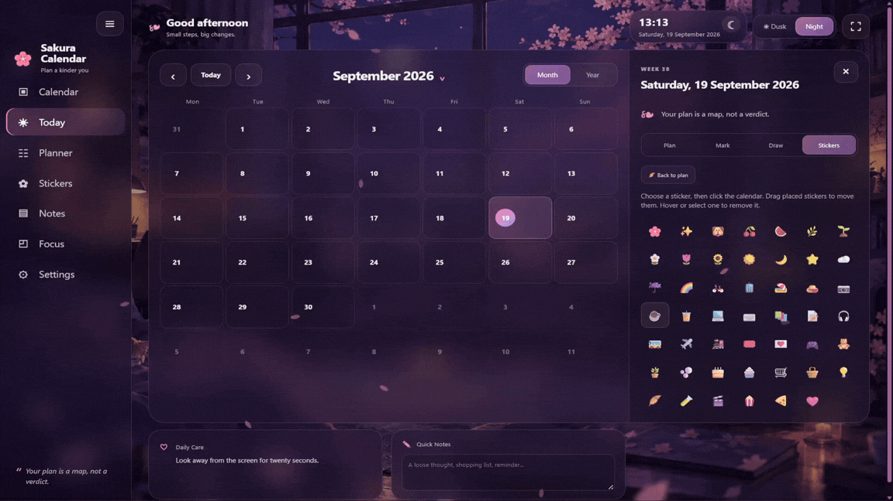

# Sakura Calendar 🌸

A calm, local-first calendar and personal planner with soft Sakura-inspired Dusk and Night themes.

<p align="center">
  
</p>

## Features

- Responsive month and year calendar views
- Multi-year navigation and a live date/clock
- Daily notes and time blocks
- Colored date markers
- Freehand drawing, eraser, brush colors and sizes
- Draggable and removable lifestyle stickers
- Quick Notes with auto-save
- Daily motivational quotes and Daily Care reminders
- Focus mode
- Dusk / Night backgrounds and falling sakura petals
- Local browser persistence
- JSON backup export and import
- No framework, build process, account, backend, CDN, or database required

## Privacy

Sakura Calendar is local-first. Notes, plans, marks, drawings, stickers, settings, and other calendar data are stored in your browser using `localStorage`.

The repository contains no personal calendar data. Nothing is uploaded by the app.

For important plans, use **Settings → Export backup** occasionally. Clearing browser site data can remove local storage.

## 🚀 Getting Started

Sakura Calendar runs entirely in your browser — no installation or backend is required.

### 🌸 Option 1 — Open directly

The easiest way to use Sakura Calendar:

1. Download or clone the repository.
2. Open the project folder.
3. Double-click `index.html`.

That's it! Sakura Calendar will open directly in your browser.

### 🖥️ Option 2 — Run with a local server

For a stable local development environment, you can run Sakura Calendar using Python:

```bash
python -m http.server 8080
```

Then open:

`http://localhost:8080`

You can also use the VS Code **Live Server** extension if you prefer.

### 🌐 Option 3 — GitHub Pages

Sakura Calendar can also be used directly from your browser through GitHub Pages:

**[Open Sakura Calendar 🌸](YOUR_GITHUB_PAGES_URL)**

> Your calendar data is stored locally in your browser using `localStorage`. Different URLs or browser profiles have separate storage, so data created by opening `index.html` directly will not automatically appear on the GitHub Pages version.

## Project structure

```text
Sakura_Calendar/
├─ index.html
├─ styles.css
├─ app.js
├─ README.md
├─ TESTING.md
└─ assets/
   ├─ bg-dusk.webp
   ├─ bg-night.webp
   ├─ favicon.png
   └─ favicon_1.png
```

## GitHub Pages

This is a static project, so it can be deployed directly with GitHub Pages.

1. Push the project to a GitHub repository.
2. Open **Settings → Pages** in the repository.
3. Under **Build and deployment**, choose **Deploy from a branch**.
4. Select the `main` branch and `/ (root)` folder.
5. Save and wait for the deployment to finish.

## Backup files

Exported personal backup files should stay private and should not be committed to the repository.
